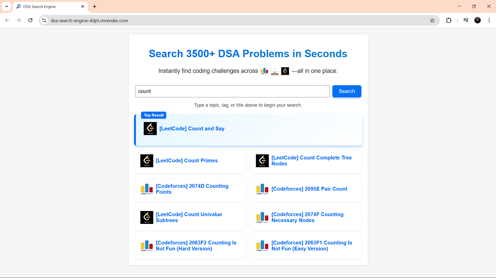

# 🔍 DSA Search Engine

A **fully deployed, in-memory TF-IDF search engine** for **Data Structures & Algorithms problems**, aggregating questions from **LeetCode**, **Codeforces**, and **CodeChef**.

Built using **vanilla JavaScript**, **Node.js**, and **Express**, this project requires **no external database** and focuses on search relevance, text preprocessing, and ranking algorithms.

🌐 **Live Demo:**  
👉 https://dsa-search-engine-ddpt.onrender.com

---



---

## ✨ Features

- **Unified Dataset**
  - Merges problems from LeetCode, Codeforces, and CodeChef into a single dataset (`all_problems.json`)

- **Custom TF-IDF Search Engine**
  - Text normalization (lowercasing, punctuation removal)
  - Tokenization and stop-word removal
  - Porter stemming
  - Document Frequency (DF) & Inverse Document Frequency (IDF)
  - Sparse TF-IDF vector construction
  - Cosine similarity–based ranking

- **Search API**
  - `POST /search`
  - Accepts `{ query: string }`
  - Returns **top 10 most relevant problems**

- **Vanilla Frontend**
  - Pure HTML, CSS, and JavaScript
  - Responsive layout (desktop & mobile)
  - Card-based results UI

---

## 🧰 Tech Stack

- **Backend:** Node.js, Express
- **Search Engine:** Custom TF-IDF implementation
- **Frontend:** HTML, CSS, JavaScript
- **Deployment:** Render (single service – API + static frontend)

---

## 🧰 Prerequisites

- **Node.js** v18+

---

## 🔧 Installation & Local Setup

1. **Clone the repository**
   ```bash
   git clone https://github.com/Zfocc31/dsa-search-engine.git
   cd dsa-search-engine
Install dependencies

bash
Copy code
npm install
Generate unified dataset

bash
Copy code
node merge.js
# Generates all_problems.json
▶️ Running the Application
bash
Copy code
node src/index.js
Frontend available at: http://localhost:3000

API endpoint: POST /search

⚙️ How It Works
Data Loading

tfidfIndex.js loads all_problems.json into memory at server startup.

Preprocessing

Lowercasing and punctuation removal

Tokenization

Stop-word filtering

Porter stemming

Index Building

Compute document frequency (DF)

Calculate inverse document frequency (IDF)

Build sparse TF-IDF vectors for each problem

Search Flow

User query is preprocessed identically

Query TF-IDF vector is generated

Cosine similarity is computed against all documents

Top 10 ranked results are returned

🚀 Deployment
The application is deployed on Render as a single Node.js service serving both:

REST API

Static frontend

🔗 Live URL: https://dsa-search-engine-ddpt.onrender.com

👤 Author
Rahul Sinha
GitHub: https://github.com/Zfocc31